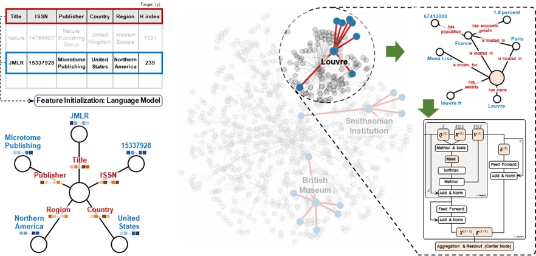

[](https://pypi.org/project/carte-ai/)
[](https://pypi.org/project/carte-ai/)
[](https://pypi.org/project/carte-ai/)
[](https://github.com/psf/black)
[](https://opensource.org/licenses/BSD-3-Clause)

[](https://huggingface.co/datasets/inria-soda/carte-benchmark)
[](https://arxiv.org/pdf/2402.16785)


# CARTE: <br />Pretraining and Transfer for Tabular Learning



This repository contains the implementation of the paper CARTE: Pretraining and Transfer for Tabular Learning.

CARTE is a pretrained model for tabular data by treating each table row as a star graph and training a graph transformer on top of this representation.

## Colab Examples (Give it a test):
[](https://colab.research.google.com/drive/1PeltEmNLehQ26VQtFJhl7OxnzCS8rPMT?usp=sharing)
* CARTERegressor on Wine Poland dataset
* CARTEClassifier on Spotify dataset
  
Other datasets are available for testing: [datasets](https://huggingface.co/datasets/inria-soda/carte-benchmark/tree/main/data_raw)

### 01 Install 🚀

The library has been tested on Linux, MacOSX and Windows.

CARTE-AI can be installed from [PyPI](https://pypi.org/project/carte-ai):

<pre>
pip install carte-ai
</pre>

#### Post installation check
After a correct installation, you should be able to import the module without errors:

```python
import carte_ai
```

### 02 CARTE-AI example on sampled data step by step ➡️

#### 1️⃣ Load the Data 💽
```python
import pandas as pd
from carte_ai.data.load_data import *

num_train = 128  # Example: set the number of training groups/entities
random_state = 1  # Set a random seed for reproducibility
X_train, X_test, y_train, y_test = wina_pl(num_train, random_state)
print("Wina Poland dataset:", X_train.shape, X_test.shape)
```


#### 2️⃣ Convert Table 2 Graph 🪵

The basic preparations are:
- preprocess raw data
- load the prepared data and configs; set train/test split
- generate graphs for each table entries (rows) using the Table2GraphTransformer
- create an estimator and make inference

```python
import fasttext
from huggingface_hub import hf_hub_download
from carte_ai import Table2GraphTransformer

model_path = hf_hub_download(repo_id="hi-paris/fastText", filename="cc.en.300.bin")

preprocessor = Table2GraphTransformer(fasttext_model_path=model_path)

# Fit and transform the training data
X_train = preprocessor.fit_transform(X_train, y=y_train)

# Transform the test data
X_test = preprocessor.transform(X_test)
```


#### 3️⃣ Make Predictions🔮
For learning, CARTE currently runs with the sklearn interface (fit/predict) and the process is:
- Define parameters
- Set the estimator
- Run 'fit' to train the model and 'predict' to make predictions

```python
from carte_ai import CARTERegressor, CARTEClassifier

# Define some parameters
fixed_params = dict()
fixed_params["num_model"] = 10 # 10 models for the bagging strategy
fixed_params["disable_pbar"] = False # True if you want cleanness
fixed_params["random_state"] = 0
fixed_params["device"] = "cpu"
fixed_params["n_jobs"] = 10
fixed_params["pretrained_model_path"] = config_directory["pretrained_model"]


# Define the estimator and run fit/predict

estimator = CARTERegressor(**fixed_params) # CARTERegressor for Regression
estimator.fit(X=X_train, y=y_train)
y_pred = estimator.predict(X_test)

# Obtain the r2 score on predictions

score = r2_score(y_test, y_pred)
print(f"\nThe R2 score for CARTE:", "{:.4f}".format(score))
```


### 03 Reproducing paper results ⚙️

➡️ [installation instructions setup paper](INSTALL.md)

### 04 Contribute to the package 🚀

➡️ [read the contributions guidelines](CONTRIBUTIONS.md)

### 05 Star History ⭐️


### 06 CARTE-AI references 📚

```
@article{kim2024carte,
  title={CARTE: pretraining and transfer for tabular learning},
  author={Kim, Myung Jun and Grinsztajn, L{\'e}o and Varoquaux, Ga{\"e}l},
  journal={arXiv preprint arXiv:2402.16785},
  year={2024}
}
```
